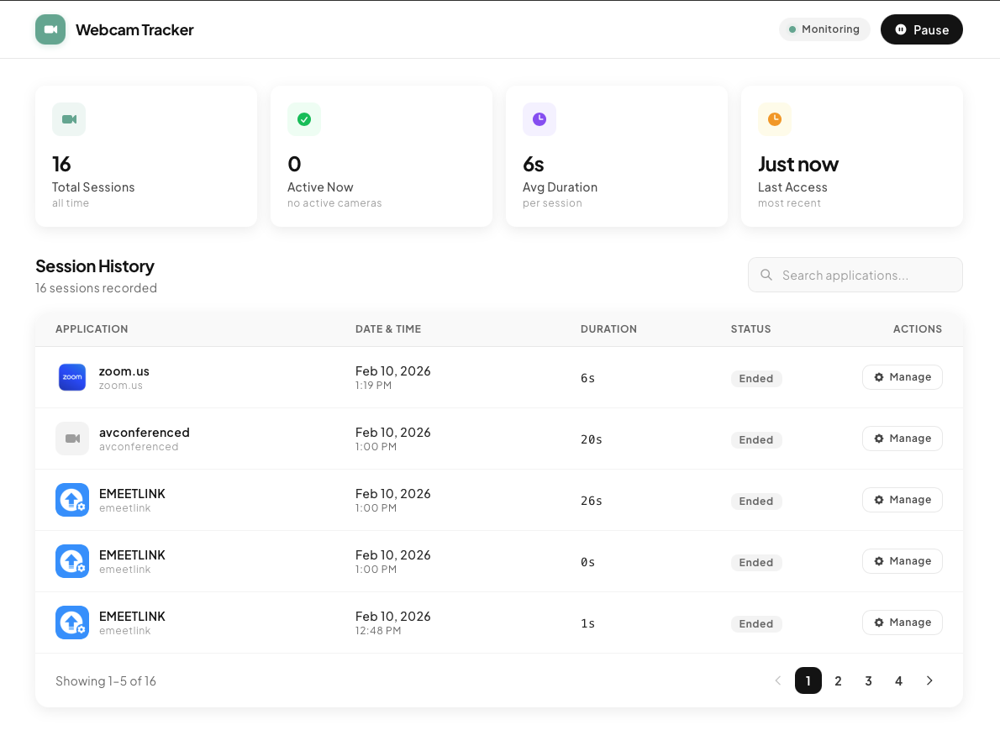

# Webcam Tracker

A privacy-focused macOS desktop application that monitors which apps are using your webcam, how long they use it, and logs every session — all without ever accessing your camera feed. Built with [Tauri 2](https://tauri.app/), Rust, React, and TypeScript.

## Download

[**Download Webcam Tracker for macOS**](https://github.com/roopamgarg/webcam-usage-tracker/releases/latest)

> Available for both Apple Silicon and Intel Macs. Requires macOS 13+ (Ventura or later).

### Installation

1. Download the `.dmg` from the link above and open it.
2. Drag **Webcam Tracker** into your **Applications** folder.
3. **Important — bypass the "developer cannot be verified" warning:**

   The app is not signed with an Apple Developer ID, so macOS Gatekeeper will block it on first launch. To fix this, run the following command in **Terminal** after dragging the app to Applications:

   ```bash
   xattr -cr /Applications/Webcam\ Tracker.app
   ```

   Alternatively, you can **right-click** (or Control-click) the app in Finder and choose **Open** — macOS will give you the option to open it anyway.

4. On first launch, grant **Full Disk Access** when prompted (System Settings → Privacy & Security → Full Disk Access).

## Screenshot



## What It Does

- **Tracks webcam sessions** — records when an app starts and stops using your camera, along with the session duration.
- **Identifies the app** — shows which application (FaceTime, Zoom, Google Meet, etc.) triggered the camera.
- **Dashboard with stats** — displays total sessions, currently active cameras, average duration, and last access time.
- **CSV export** — export your full session history to a CSV file at any time.
- **Pause / Resume** — temporarily stop monitoring without quitting the app.
- **100% local** — no network calls, no cloud sync. All data is stored in a local SQLite database on your machine.

## How Webcam Tracking Works

The app **never opens or reads from your camera**. Instead, it leverages the macOS unified logging system to detect camera activity:

1. **macOS `log stream`** — On macOS, every time an app starts or stops using the camera, the system logs an event under the `com.apple.cameracapture` subsystem via `AVCaptureSession`. The app spawns a `log stream` process that watches for these events in real-time:

   ```
   log stream --style syslog \
     --predicate '(subsystem == "com.apple.cameracapture") AND
       (eventMessage CONTAINS "startRunning]" OR
        eventMessage CONTAINS "stopRunning]")' \
     --info
   ```

2. **Log line parsing** — Each syslog line is parsed to extract:
   - Whether it's a **start** (`startRunning]:`) or **stop** (`stopRunning]:`) event.
   - The **application name** from the process token (e.g. `FaceTime[1234]:` → `FaceTime`).
   - Noise lines (filter headers, backtraces, `<private>` redacted entries) are filtered out.

3. **Session management** — When a `startRunning` event is detected, a new session is created in the SQLite database. When the corresponding `stopRunning` event fires, the session is closed and the duration is calculated. Multiple apps can have concurrent active sessions.

4. **Orphan recovery** — If the app crashes or is force-quit while sessions are still running, those orphaned sessions are automatically closed on the next launch.

### Why Full Disk Access Is Required

Reading from the `com.apple.cameracapture` log subsystem requires **Full Disk Access** on macOS. The app checks for this permission on first launch and guides you through enabling it in System Settings → Privacy & Security → Full Disk Access.

## Tech Stack

| Layer    | Technology                          |
| -------- | ----------------------------------- |
| Runtime  | [Tauri 2](https://tauri.app/)       |
| Backend  | Rust                                |
| Frontend | React 18 + TypeScript               |
| Styling  | Tailwind CSS                        |
| Database | SQLite (via `rusqlite`)             |
| Platform | macOS only (uses `log stream` APIs) |

## Project Structure

```
├── src/                        # Frontend (React + TypeScript)
│   ├── components/
│   │   ├── Dashboard.tsx       # Main dashboard layout
│   │   ├── StatsCards.tsx      # Summary statistics cards
│   │   ├── SessionList.tsx     # Paginated session table
│   │   ├── SessionRow.tsx      # Individual session row
│   │   ├── TrackingControls.tsx# Pause/resume & export buttons
│   │   ├── PermissionGate.tsx  # Consent & permission setup flow
│   │   └── AppIcon.tsx         # App icon resolver
│   ├── hooks/                  # Custom React hooks
│   ├── lib/commands.ts         # Tauri command bindings
│   └── types/session.ts        # TypeScript types
│
├── src-tauri/                  # Backend (Rust + Tauri)
│   └── src/
│       ├── camera/
│       │   ├── monitor.rs      # Spawns `log stream`, emits CameraEvents
│       │   └── platform_macos.rs # Parses syslog lines into events
│       ├── session/
│       │   ├── manager.rs      # Session lifecycle (start/end/pause)
│       │   └── models.rs       # Session & SessionStatus structs
│       ├── storage/
│       │   └── db.rs           # SQLite schema & CRUD operations
│       ├── export/
│       │   └── csv.rs          # CSV export logic
│       ├── commands.rs         # Tauri IPC command handlers
│       ├── icons.rs            # App icon data URL resolver
│       └── lib.rs              # App setup, state wiring, event loop
```

## Prerequisites

- **macOS** (the tracking mechanism is macOS-specific)
- [Node.js](https://nodejs.org/) (v18+)
- [Rust](https://www.rust-lang.org/tools/install) (stable toolchain)
- [Tauri CLI](https://tauri.app/start/create-project/) (`npm install -g @tauri-apps/cli`)

## Getting Started

```bash
# Clone the repo
git clone https://github.com/roopamgarg/webcam-usage-tracker.git
cd webcam-usage-tracker

# Install frontend dependencies
npm install

# Run in development mode
npm run tauri dev

# Build a production .dmg
npm run tauri build
```

On first launch the app will:
1. Ask you to enable **Full Disk Access** for the app.
2. Show a consent screen explaining what data is collected.
3. Begin monitoring webcam usage in the background.

## License

MIT

